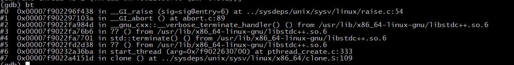
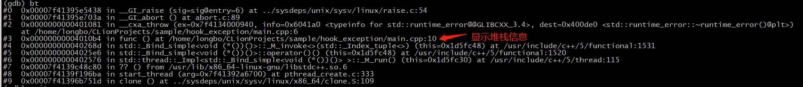

# 介绍
gcc4或以下版本，对于没有捕捉的异常，程序core dump后，不会把异常信息保存在堆栈，定位core dump问题比较棘手。
可以通过hook底层捕捉except的函数，修改程序推出的行为。
# 注意，产生core文件必须先设置：
```bash
ulimit unlimited
```
# 运行结果
没有加hook的运行效果

这是产生core文件后，用gdb看到的效果


# 参考
<https://abcdabcd987.com/libstdc++-bug/>
<https://byronhe.com/post/cpp-throw-coredump-with-backtrace/>